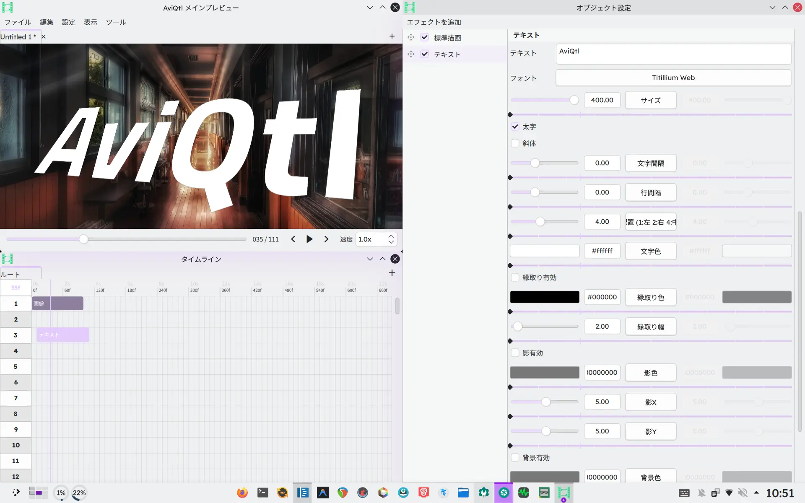

  

<b>A next-generation video editor that inherits and surpasses AviUtl</b>

  <a href="https://github.com/GT-610/AviQtl-Plus">GitHub</a>
  / <a href="https://github.com/GT-610/AviQtl-Plus/releases">Releases</a>

  <b>English</b> / <a href="./i18n/README/README.ja.md">日本語</a> / <a href="./i18n/README/README.zh_CN.md">简体中文</a>

> [!IMPORTANT]
> AviQtl-Plus is a fork of [taisho-guy/NeoUtl](https://codeberg.org/taisho-guy/NeoUtl) that continues the **Qt Quick + QRhi + ECS** development path after the upstream project was rebuilt with **Rust + Slint + wgpu**. See [About the project](https://aviqtl.gt610.dpdns.org/guide/start-here/about) for the full story.

## What is AviQtl-Plus?

A project to develop a video editor that inherits the operability of **AviUtl 1.10** & **ExEdit 0.92** while delivering **performance that surpasses AviUtl**.

See [AviUtl Operability Targets](https://aviqtl.gt610.dpdns.org/developer/operability-targets) for the editing-model compatibility goals that guide development.

### Key Features

- UI closely resembling AviUtl
- **Fast and powerful GPU-accelerated effects**
- Support for **audio effects** such as VST3 and LV2
- **LuaJIT plugin system** with package management, declarative parameters, and permission control
- Cross-platform: **Linux**, **Windows**, **macOS**

## Documentation

- [Installation](https://aviqtl.gt610.dpdns.org/guide/start-here/installation)
- [User guide](https://aviqtl.gt610.dpdns.org/guide/start-here/)
- [Build from source](https://aviqtl.gt610.dpdns.org/developer/building)
- [Developer documentation](https://aviqtl.gt610.dpdns.org/developer/)
- [Frequently asked questions](https://aviqtl.gt610.dpdns.org/guide/help-and-reference/faq)
- [About the project](https://aviqtl.gt610.dpdns.org/guide/start-here/about)

## Effect Packages

AviQtl-Plus features a modular effect system. The `effect-packages/` directory contains ready-to-use effect packs that demonstrate the extension system:

| Package | Type | Contents |
|---------|------|----------|
| [stylize-effects](effect-packages/stylize-effects/) | Effect | Glitch, pixel sorting, chromatic aberration, mosaic, noise, emboss, raster |
| [advanced-blur](effect-packages/advanced-blur/) | Effect | Lens blur, radial blur, directional blur, motion blur |
| [weather-objects](effect-packages/weather-objects/) | Object | Rain, snow animations |

These packages serve as both useful additions and developer references for creating custom effects. See [effect-packages/README.md](effect-packages/README.md) for details.

## Related Links

AviQtl-Plus stands on the shoulders of many wonderful projects.

| Project | License | Role |
| :--- | :--- | :--- |
| AviUtl | Non-free | Respected origin |
| AviQtl | AGPLv3 | Original Qt Quick project; `aviqtl` branch of the upstream |
| NeoUtl | AGPLv3 | New Rust + Slint + wgpu version by the original author |
| AviQtl-Plus | AGPLv3 | This project — continued Qt Quick + QRhi + ECS development |
| Carla | GPLv2+ | Audio effect host (VST3/LV2 etc.) |
| FFmpeg | GPLv2+ | Video/audio decoding & encoding |
| LuaJIT | MIT | High-performance script engine |
| Qt | GPLv3 | UI/UX framework |
| Zrythm | AGPLv3 | Reference for audio plugin implementation |
| Remix Icon | Remix Icon License | Symbol icons |

## License

AviQtl-Plus is released under the [GNU Affero General Public License](https://www.gnu.org/licenses/agpl-3.0.txt).

[Remix Icon](https://remixicon.com/) used within AviQtl-Plus is provided under the [Remix Icon License](https://raw.githubusercontent.com/Remix-Design/RemixIcon/refs/heads/master/License).
