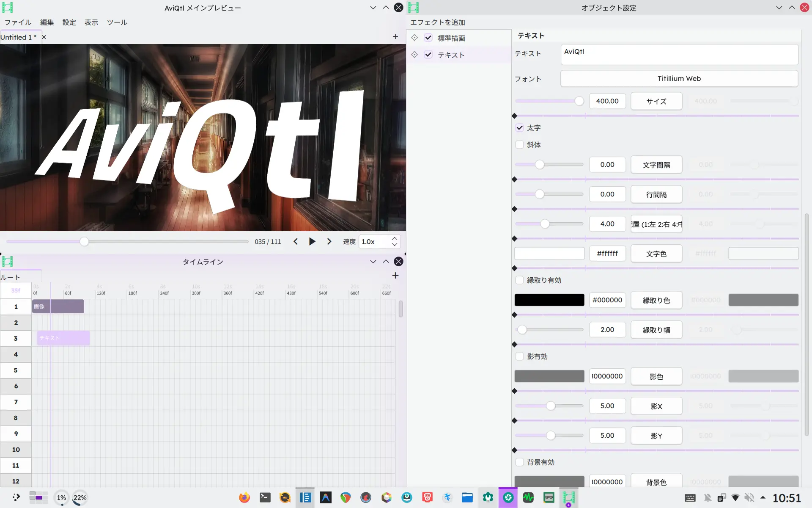

<p align="center">
  
</p>

<p align="center"><b>继承并超越 AviUtl 的次世代视频编辑软件</b></p>

<p align="center">
  <a href="https://github.com/GT-610/AviQtl-Plus">GitHub</a>
  / <a href="https://github.com/GT-610/AviQtl-Plus/releases">发行版</a>
</p>

<p align="center">
  <a href="../../README.md">English</a> / <a href="./README.ja.md">日本語</a> / <b>简体中文</b>
</p>

> [!IMPORTANT]
> 本仓库是 [taisho-guy/NeoUtl](https://codeberg.org/taisho-guy/NeoUtl) 的 fork。2026 年 5 月底，原作者决定**重置开发**——现在的 `main` 分支已更换为基于 **Qt Widgets + SDL3 + bgfx** 的新 NeoUtl，而原 Qt Quick 版本已移至 `legacy` 分支（称为 **NeoUtl Legacy**）。我（[GT610](https://github.com/GT-610)）作为原项目的早期核心贡献者，将继续 Qt Quick 路线，以 **AviQtl-Plus** 的名义继续开发。
>
> 因此，目前有三个 NeoUtl 相关项目并行存在：
> - **[NeoUtl](https://codeberg.org/taisho-guy/NeoUtl)** — 使用新技术栈重建的原项目
> - **[NeoUtl Legacy](https://codeberg.org/taisho-guy/NeoUtl/src/branch/legacy)** — 原 Qt Quick 版本，不再更新
> - **AviQtl-Plus（本项目）** — 继续发展 Qt Quick + QRhi + ECS 路线的 fork

### 原项目暂停开发的原因

原作者发现了以下 Qt Quick 的根本性问题：

- Qt Quick 独有的资源管理与 Compute Shader 不兼容，导致实现困难
- 同理，与 ECS 架构不兼容，优化困难
- 实时处理存在性能隐患

### AviQtl-Plus 的应对方案

基于原项目获得的经验，AviQtl-Plus 将着力解决这些挑战：

1. **Compute Shader 集成**：绕过 Qt Quick 的限制，利用 GPU Compute 实现高性能特效处理
2. **ECS 架构优化**：最大化数据驱动设计的优势，同时消除与 Qt Quick 的摩擦
3. **实时性能提升**：消除预览渲染瓶颈，提供流畅的编辑体验

愿景不变：**打造一款继承并超越 AviUtl 的视频编辑软件**。我们相信 Qt Quick + QRhi + ECS 是一条可行且有价值的路线——我们将致力于将其打磨为实用、日常可用的编辑工具。

### 原作者的新方向

原作者已经将计划付诸实践——新的 `main` 分支正在以 **Qt Widgets + SDL3 + bgfx** 为基础从零重建，这反映了他们坚信 Qt Quick 不适合他们未来以 Compute Shader 为核心的技术愿景。他们已经声明在核心实现阶段不接受 PR。

旧的 Qt Quick 源代码仍在 [`legacy` 分支](https://codeberg.org/taisho-guy/NeoUtl/src/branch/legacy) 可用，原作者也[明确推荐](https://codeberg.org/taisho-guy/NeoUtl)喜欢 Qt Quick 路线的用户使用 AviQtl-Plus。

### 与新版 NeoUtl 的关系

原作者和我保持着友好关系。如果 AviQtl-Plus 的某些贡献对新的 NeoUtl 适用，我会很乐意向上游提交。同样，我希望两个项目的成果能随着时间的推移相互滋养——最终造福所有寻求现代化、强大且直观的 AviUtl 替代品的用户。

## 什么是 [AviQtl-Plus](https://github.com/GT-610/AviQtl-Plus)？



一个旨在继承 **AviUtl 1.10** 和 **ExEdit 0.92** 的操作体验，同时拥有**超越 AviUtl 性能**的视频编辑软件项目。

### 主要特性

- 与 AviUtl 极为相似的用户界面
- 使用 GPU 实现的**高速强大特效**
- 支持 VST3、LV2 等**音频特效**
- **LuaJIT 插件系统**，支持包管理、声明式参数和权限控制
- 跨平台：**Linux**、**Windows**、**macOS**

## 安装步骤

1. 在 Linux 上，安装以下依赖：
   - Qt6 全套、LuaJIT、Vulkan 实现（如 Mesa）、FFmpeg、Carla、libc++
2. 从[发行版页面](https://github.com/GT-610/AviQtl-Plus/releases)下载适合您系统的构建版本。
3. 解压文件，为 `AviQtl` 添加执行权限后运行。

> [!NOTE]
> Linux 用户需要与 Arch Linux 相当的最新环境。强烈建议使用 Ubuntu 等其他发行版的用户通过 [Distrobox](https://distrobox.it/) 创建 Arch Linux 容器，并在其中运行 AviQtl。

## 构建步骤

`BUILD.py` 会自动检测当前操作系统并确定构建目标。通常只需 `python BUILD.py` 即可，但也支持手动指定。

首先克隆仓库：

```bash
git clone https://github.com/GT-610/AviQtl-Plus.git
cd AviQtl-Plus
```

<details>
<summary>Linux</summary>

在 Linux 上，默认使用 distrobox/podman 容器隔离构建环境。

1. **安装依赖**
   - Pacman: `sudo pacman -S --needed distrobox podman python git`
   - APT: `sudo apt install distrobox podman python3 git`
   - DNF: `sudo dnf install distrobox podman python3 git`
2. **构建**
   - `python BUILD.py --arch`
3. **运行**
   - `./build/AviQtl`
</details>

<details>
<summary>macOS</summary>

在 macOS 上，`BUILD.py` 通过 Homebrew 检查并安装依赖（CMake、Ninja、Qt6 等），然后执行 `macdeployqt` 和 `codesign` 创建 `.app` 包。

1. **安装依赖**
   - `brew install python git`
2. **构建**
   - `python BUILD.py --xcode`
3. **运行**
   - `open ./build/AviQtl.app`
</details>

<details>
<summary>Windows (MSYS2)</summary>

1. **安装依赖**
   - `pacman -S git mingw-w64-ucrt-x86_64-python`
2. **构建**
   - `python BUILD.py --msys2`
3. **运行**
   - `./build/AviQtl.exe`
</details>

<details>
<summary>Windows (MSVC - 不推荐)</summary>

由于环境配置复杂，不推荐使用 MSVC 构建。

1. **额外准备**
   - Visual Studio 2022 Build Tools 的 C++ 工具集
   - 官方 Qt 的 MSVC x64 版本（如 `msvc2022_64`）
   - vcpkg（可通过 `VCPKG_ROOT` 环境变量指定；如未找到，`BUILD.py` 将尝试自动获取）
2. **构建**
   - `python BUILD.py --msvc --qt-dir <Qt 安装目录>`
   - 如省略 `--qt-dir`，将尝试从 `QT_MSVC_DIR` 等环境变量自动检测。
3. **运行**
   - `.\build\AviQtl.exe`
</details>

## 常见问题

> [!NOTE]
> 以下常见问题反映的是原作者（taisho-guy）的个人观点和开发经历。

<details>
<summary>开发的契机是什么？</summary>

### 操作系统的壁垒
起因是 AviUtl 无法在 Linux 上运行。**仅为 AviUtl 而维护 Windows 环境**是难以接受的。

### 膨胀的生态系统
无论出于何种原因，不少人"不得不"继续使用 AviUtl。经过长年扩展而变得臃肿的生态系统如同"哈尔的移动城堡"，即使心怀不满也难以割舍。

### 项目目标与使命
在[鹿儿岛县立甲南高等学校](https://edunet002.synapse-blog.jp/konan/)的课题研究中，为解决这一问题，决定独立开发 NeoUtl。

- **个人目标：** 无需在 Domino、VocalShifter、REAPER、AviUtl 之间来回切换，仅用 Linux 上的 NeoUtl 即可制作音 MAD。
- **NeoUtl 的使命：** 成为那些"不得不"使用 AviUtl 的人的最佳解决方案。
</details>

<details>
<summary>为什么要开发 AviUtl 的克隆？</summary>

AviQtl-Plus 并非"重新发明 AviUtl"。虽然深受 AviUtl 影响，但内部实现完全不同。

| 项目 | AviQtl-Plus | ExEdit0 | ExEdit2 |
| :--- | :--- | :--- | :--- |
| 核心技术 | Qt6 | Win32 API | Win32 API |
| 并行处理模型 | 数据驱动（ECS） | 单线程 | 多线程 |
| 内存空间 | 64位 | 32位（最大4GB） | 64位 |
| 预览渲染 | Vulkan / Metal / DX12 | GDI | DX11 |
| 音频引擎 | Carla（VST3/LV2等） | 仅内置功能 | 仅内置功能 |
| 插件系统 | LuaJIT / C++ / QML / GLSL | Lua / C++ | LuaJIT / C++ |
| 支持的操作系统 | Linux、Windows、macOS | Windows | Windows |

AviQtl-Plus 从根本上解决结构性弱点：
1. **基于 ECS（实体组件系统）的数据导向设计：** 极大提升 CPU 缓存效率，加速大量对象的处理。
2. **现代化内存管理：** 采用 C++23 智能指针，从结构上最小化原因不明的崩溃。
3. **UI 与渲染分离：** 即使在繁重的渲染过程中，时间线操作也不会受阻，高 DPI 环境下 UI 依然清晰。
</details>

<details>
<summary>名称和图标的由来？</summary>

名称是"AviUtl"和"Qt"的合成词。
图标是 Qt 和 AviUtl 标志的组合设计。

<p align="center">
   +  = 
</p>
</details>

<details>
<summary>可以使用 AviUtl 的插件吗？</summary>

不可以。由于机制不同，不兼容。也没有计划实现兼容层。
</details>

### AviQtl-Plus 常见问题

> [!NOTE]
> 以下常见问题反映的是 AviQtl-Plus 维护者（[GT610](https://github.com/GT-610)）的观点。

<details>
<summary>为什么要继续开发 AviQtl-Plus？</summary>

原项目因 Qt Quick 的技术难题而暂停，但同时也证明了 **Qt + FFmpeg 可以快速实现高质量的视频编辑器原型**。项目架构设计优秀，基础扎实。尤其现在 QRhi 提供了可行的 Compute Shader 路径，我认为 Qt Quick 路线仍然值得继续探索。

作为早期的核心贡献者，我亲眼目睹了这个项目的潜力。我接过原作者留下的代码，不仅是为了让项目继续存活，更是为了实现最初的愿景——打造一款继承 AviUtl 操作体验并超越其性能的视频编辑软件。
</details>

<details>
<summary>AviQtl-Plus 的路线图是什么？</summary>

**已完成（0.3.0）：**
- 具备生命周期钩子、声明式参数和细粒度权限控制的 LuaJIT 插件系统
- 支持从远程仓库安装/更新插件、特效和对象的包管理器
- 覆盖核心、引擎、脚本和插件子系统的 24 项单元测试
- 通过 GitHub Actions 实现的 CI（构建 + 静态分析）

**下一步（0.3.x-0.4.0）：**
- 扩展特效和对象插件生态（第三方特效注册 API、特效插件示例）
- 音频编辑和混音打磨（per-track 控件、混音面板）
- 性能优化和 GPU Compute Shader 改进
- 配备自动化 CI/CD 的初期公开 Alpha 版本发布

**长期：**
- 成为足以替代 AviUtl 的全功能视频编辑器
- 考虑更名和品牌重塑（名称和 Logo），以反映项目独立的发展方向
- 持续关注新版 NeoUtl 的进展，探索项目间相互借鉴的机会

本项目完全由个人动力驱动，没有截止日期或商业压力。进展会保持稳定但节奏适中。
</details>

<details>
<summary>AviQtl-Plus 与原项目有什么不同？</summary>

技术方向大致相同（Qt Quick + QRhi + ECS），但 AviQtl-Plus 更注重：

- **渐进式交付**：先让基本编辑功能可用，而非一开始就追求架构完美
- **务实解决问题**：在 Qt Quick 的约束范围内寻找最优解，而非将其视为障碍
- **社区透明度**：清晰记录 fork 关系、计划和长期意图

项目达到可用状态后，可能会进行更名和品牌重塑，以明确与原始项目的区分。
</details>

## 相关链接

AviQtl-Plus 站在众多优秀项目的肩膀上。

| 项目 | 许可证 | 角色 |
| :--- | :--- | :--- |
| AviUtl | 非自由 | 致敬的原型 |
| NeoUtl (Legacy) | AGPLv3 | 原 Qt Quick 版本；上游的 `legacy` 分支 |
| NeoUtl | AGPLv3 | 原作者的新 Qt Widgets + bgfx 版本 |
| AviQtl-Plus | AGPLv3 | 本项目 — 继续 Qt Quick + QRhi + ECS 开发 |
| Carla | GPLv2+ | 音频特效宿主（VST3/LV2等） |
| FFmpeg | GPLv2+ | 视频/音频编解码 |
| LuaJIT | MIT | 高性能脚本引擎 |
| Qt | GPLv3 | UI/UX 框架 |
| Zrythm | AGPLv3 | 音频插件实现参考 |
| Remix Icon | Remix Icon License | 符号图标 |

## 许可证

AviQtl-Plus 基于 [GNU Affero General Public License](https://www.gnu.org/licenses/agpl-3.0.txt) 发布。

AviQtl-Plus 中使用的 [Remix Icon](https://remixicon.com/) 遵循 [Remix Icon License](https://raw.githubusercontent.com/Remix-Design/RemixIcon/refs/heads/master/License)。
